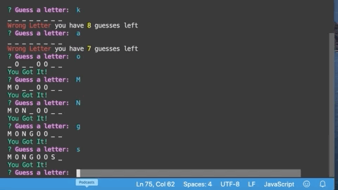

# Animal Node Hangman

This back-end application is a hangman game using Node, inquirer and Construstors to create the game.


## Sample Images
 
 To initialize the game the user would type node index and would be prompted with a question using inquirer to start the game. 
 If the user says no then a message would pop up exiting the game. But if the user says yes we can see the result in the image below.

 


Once the user starts the game all they have to do is input the letter they want to use to guess. If they are wrong a message will pop up warning them of how many guesses they have left.
if they are right a message will show up telling them they got a letter right and the letter will populate replacing the underscores.


If the user wins, then a message will come up asking if they want to try and guess another animal. If they click yes the game restarts, if no they will exit out. Below is the example if the user says yes.



Similarly, if the user looses, a message will come and ask if they want to try again. If they say yes the game will restart. If no, the game will exit as examplified below.


As mentioned above, the game tracks the guesses the user has and if they guess wrong they will have a message telling them how many guesses they have left. 

It also tracks the letters they have already used. In the example below, if the user tries to use the same letter they used before a message will display warning them that the letter was already used.


# Getting Starter

To create this application I had to create a package.json and then install the one package I used - inquirer.

## Installation

So to create the package.json, all you have to do is type in your terminal

```
npm init -y
```
The -y will allow you to skip all the questions you need to answer to initiate the package.json. 

After the package.json is initialized, then the inquirer package can be installed.

```
npm inquirer
```
To beautify the game with some color I used the Colors npm package.

```
npm colors
```

Once the dependencies were installed, then it made it possible to create the app. It is important to note that the beautifying npm packages were only installed after the app was already functional.

# Built With
+ Javascript
- Node
+ Inquirer
- Colors

# Authors

+ Sara Neves Pereira

# license

This project is licensed under the MIT License.


